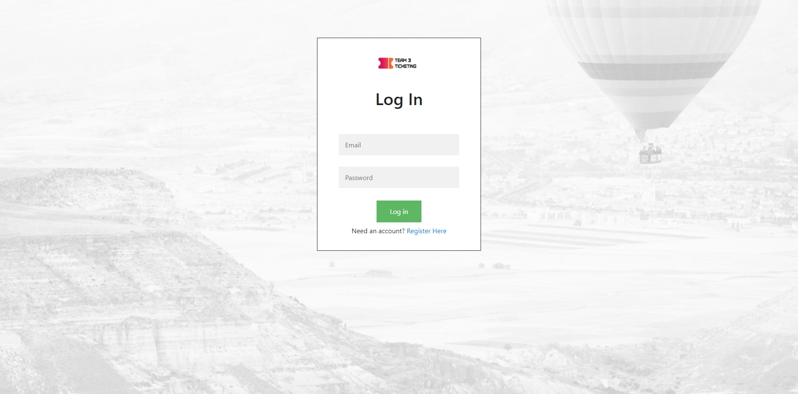

# Ticket Booking System

An online ticket booking system where users can signup and login/ logout of their account. 
They are able to view tickets available for purchase and store their tickets in a cart. 
They can remove or update quantities in their cart settings. They can search for events based
on name, location, price, seating, and time. They are able to view their tickets after purchasing.
User data such as purchase and contact information are store inside a database avaialable for 
retrieval. Database admins can view check the status of current users and other admins in the database. 

## Database

## Billing Table

## Register Page

## Login Page

## Home Page

## Events Page

## Cart Page

## Confirmation Page

## Contact Page

References:

http://learningprogramming.net/php-mysql/php/checkout-shopping-cart-in-php/

https://www.w3schools.com/howto/howto_css_checkout_form.asp
