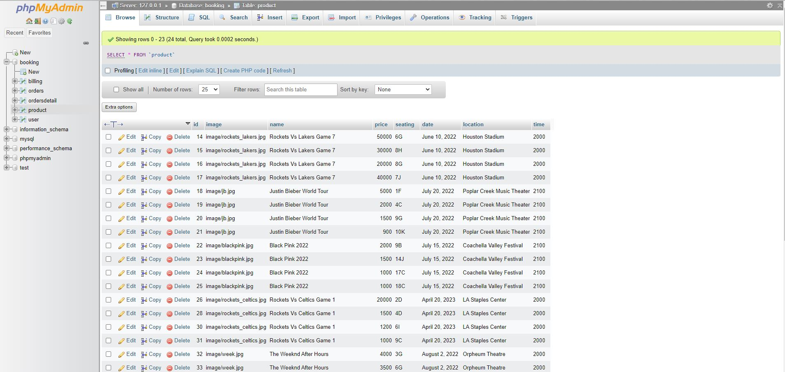
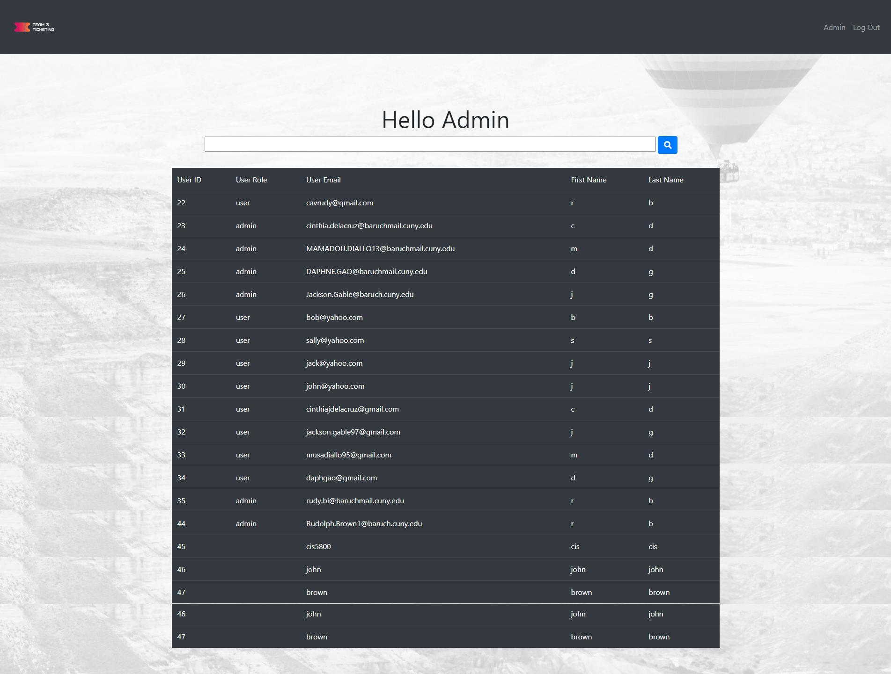
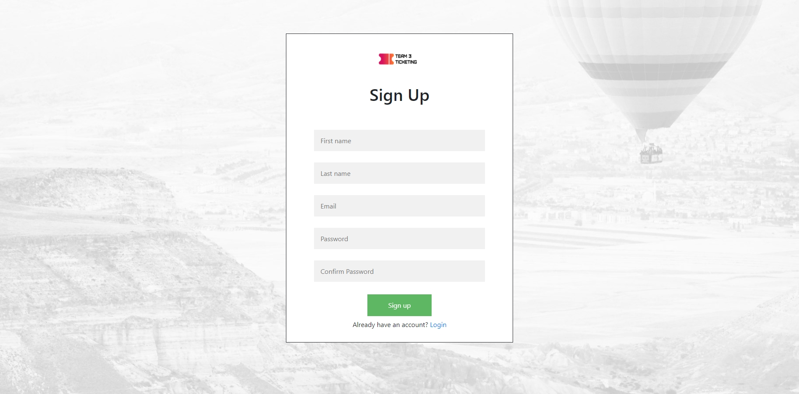
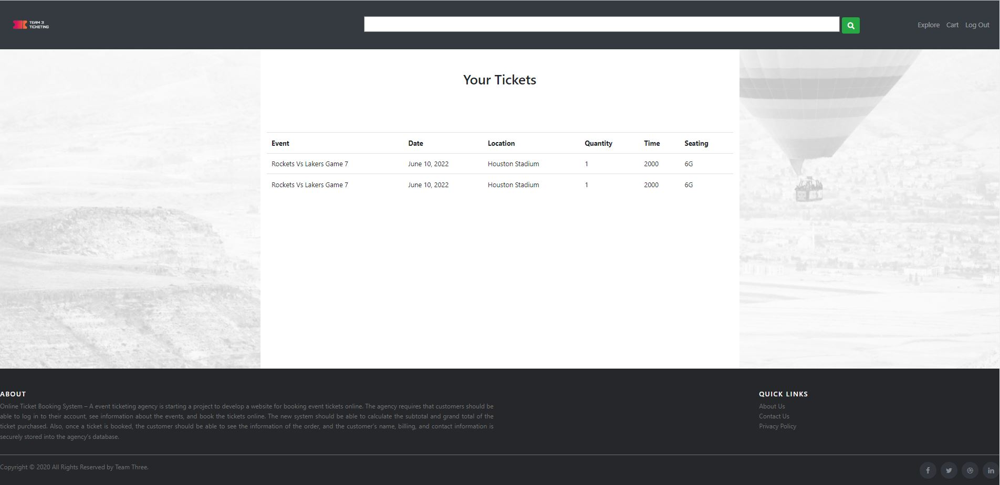
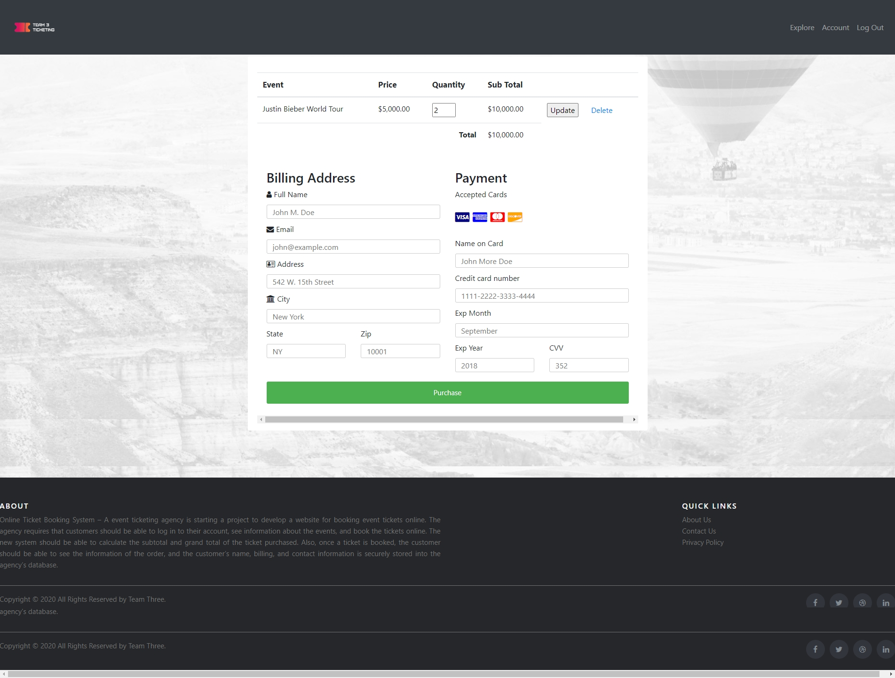
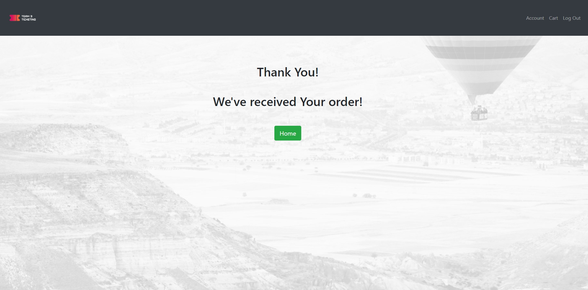

# Ticket Booking System

- An online ticket booking system where users can signup and login/ logout of their account. 
They are able to view tickets available for purchase and store their tickets in a cart. 
They can remove or update quantities in their cart settings. They can search for events based
on name, location, price, seating, and time. They are able to view their tickets after purchasing.
User data such as purchase and contact information are store inside a database avaialable for 
retrieval. Database admins can view check the status of current users and other admins in the database. 

## Database

The Database contains 5 tables: billing, orders, ordersdetail, product, and users

## Billing Table

The billing table records customer's name, email, adress, city, state, zip, and credit card information

## Orders Table

The orders table records customer's purchase dates and email adress

## Orders Detail Table

This table records order and product ID, price, quantity, and email

## Products Table

This table contains the event tickets that are on sale. The columns are: image, event name, price, seating,
date, location, and time

## Users Table

This table records both customer and admin account information: username, password, email, ID, and user type

## Admin Login Page

## Register Page

## Login Page

## Home Page

## Events Page

## Cart Page

## Confirmation Page

## Contact Page

